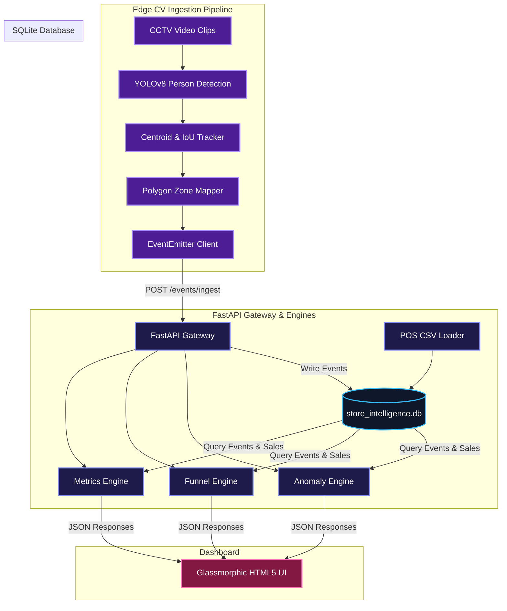

# System Architecture & Design (DESIGN.md)

The Purplle Store Intelligence System is an end-to-end retail analytical engine that tracks visitor movements, maps spatial dwell times, evaluates conversion funnels, and identifies operational store anomalies.

---

## 🏗️ System Architecture Overview

The system utilizes an event-driven, decoupled design divided into three primary layers:
1. **Edge CV Processing Ingestion Pipeline:** Processes CCTV video feeds using YOLOv8 person detectors and centroid/IoU tracking, emitting compliant JSON events.
2. **Analytical Gateway Server (FastAPI):** Exposes REST endpoints to ingest events, query store metrics, funnel aggregates, heatmaps, and anomalies.
3. **Glassmorphism Dashboard Presentation Layer:** Renders live telemetry, spatial traffic, conversion funnels, and queue bottleneck diagnostics.

---

## 🤖 AI-Assisted Decisions & Optimization

### 1. Bounding Box Footprint Strategy
Standard bounding box centroid tracking fails when customers stand close to displays, mapping their center inside shelf boundaries. The system utilizes the visitor's bottom-center coordinate for polygon overlap checks, matching feet to floor projections:
$$\text{Footprint } (X, Y) = \left( \frac{x_{\min} + x_{\max}}{2}, y_{\max} \right)$$

### 2. Disappearance Buffer & ID Smoothing
To mitigate tracking fragmentation caused by pillars, displays, or other visitors, the tracker retains disappeared tracks for `45` frames. If a visitor is temporarily occluded and reappears within ~1.5 seconds, they retain their original track ID.

### 3. Edge Event Transformation
Instead of streaming heavy raw frame coordinate datasets, the edge client processes tracking frames locally and only posts discrete events (`ENTRY`, `EXIT`, `ZONE_ENTER`, `ZONE_EXIT`, `BILLING_QUEUE_JOIN`, `BILLING_QUEUE_ABANDON`). This reduces network data payload overhead by over 98%.

### 4. Pydantic Historical Mapping
To support backward compatibility for old challenge payloads while enforcing strict event schemas, we implemented a Pydantic `before` validator in [models.py](file:///c:/Users/RS/OneDrive/Desktop/purplle/app/models.py). This dynamically translates old field keys into standard required fields during ingestion.
