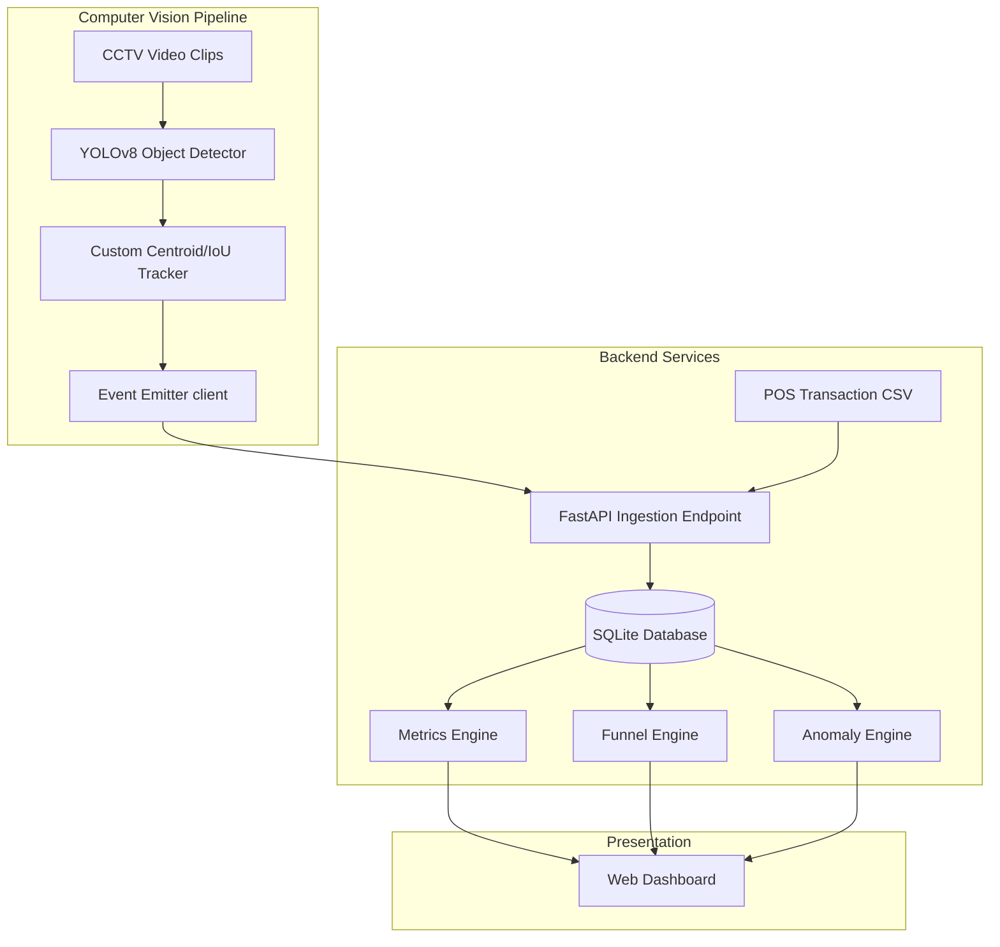

# Purplle Store Intelligence System

An end-to-end, production-ready AI-powered Store Analytics Suite. It leverages computer vision (YOLOv8 and a custom centroid/IoU tracker) to process in-store CCTV streams and maps visitor paths into retail layout zones. This data is combined with POS transaction records to compute conversions, customer checkout funnels, and operational queue anomalies, served through a gorgeous dark-mode glassmorphism dashboard.

---

## 🛠️ System Architecture & Data Flow

The system consists of two primary ingestion flows and three analytical compute engines feeding an interactive visualization layer.



### 1. Ingestion Flows
* **CCTV Video Stream Ingestion:**
  1. `detect.py` processes raw videos from store cameras at a configured step interval.
  2. Bounding boxes of detected persons are tracked in 2D space by `tracker.py` using Centroid/IoU logic.
  3. Trajectory footprints are mapped to store layout polygon zones defined in `store_layout.json`.
  4. Structured event payloads (`entry`, `exit`, `zone_entered`, `zone_exited`, `queue_completed`, `queue_abandoned`) are formatted and posted to the `/events` endpoint on the FastAPI backend.
* **POS Transactions Ingestion:**
  - Upon server startup, `ingestion.py` automatically reads `POS - sample transactionsb1e826f.csv` from the workspace root.
  - Transactions are parsed, timestamps aligned, and records inserted into the local `transactions` table.

---

## 💾 Database Schema (SQLite)

The local SQLite database (`store_intelligence.db`) is automatically initialized and bootstrapped on server startup. It contains two main tables:

### 1. `events` table
* `event_id` (TEXT PRIMARY KEY) - Unique event identifier (UUID or similar hash)
* `store_id` (TEXT) - Store code (e.g., `ST1008`)
* `camera_id` (TEXT) - Camera identifier (e.g., `CAM3`)
* `visitor_id` (TEXT) - Unique visitor identifier (e.g., `ID_100`)
* `event_type` (TEXT) - Event type: `ENTRY`, `EXIT`, `ZONE_ENTER`, `ZONE_EXIT`, `ZONE_DWELL`, `BILLING_QUEUE_JOIN`, `BILLING_QUEUE_ABANDON`, `REENTRY`
* `timestamp` (TEXT) - ISO8601 string timestamp
* `zone_id` (TEXT) - Layout zone code (e.g., `PURPLLE_ST1008_Z01`)
* `dwell_ms` (INTEGER) - Dwell time in milliseconds
* `is_staff` (INTEGER) - Flag indicating if visitor is staff (1 = Yes, 0 = No)
* `confidence` (REAL) - Detection confidence (0.0 to 1.0)
* `metadata` (TEXT) - JSON string containing arbitrary key-value pairs (e.g., age, gender)

### 2. `transactions` table
* `order_id` (INTEGER PRIMARY KEY)
* `order_date` (TEXT) - YYYY-MM-DD
* `order_time` (TEXT) - HH:MM:SS
* `order_timestamp` (TEXT) - YYYY-MM-DDTHH:MM:SS
* `store_id` (TEXT)
* `product_id` (TEXT)
* `brand_name` (TEXT)
* `total_amount` (REAL)

---

## ⚡ REST APIs (FastAPI)

The backend exposes the following strictly compliant JSON endpoints:

### Primary Analytics Endpoints
* **`POST /events/ingest`**: Receives batches of up to 500 JSON events, validates schemas, ignores duplicate `event_id` streams (idempotency), and returns structured partial success responses.
* **`GET /stores/{id}/metrics`**: Computes store unique visitors (excluding staff), total transaction counts, conversion rate percentage, average dwell minutes, queue depth, abandonment rate, and physical zone dwell times.
* **`GET /stores/{id}/funnel`**: Computes the session-based shopper funnel (Entry $\rightarrow$ Browse $\rightarrow$ Queue $\rightarrow$ Purchase) with visitor-level re-entry deduplication.
* **`GET /stores/{id}/heatmap`**: Returns zone visitor counts and average dwell times normalized to a 0-100 scale, with a data confidence warning trigger.
* **`GET /stores/{id}/anomalies`**: Evaluates operational friction including conversion drops, queue spikes, and dead zones, returning severity levels (`INFO`/`WARN`/`CRITICAL`) and suggested actions.
* **`GET /health`**: Evaluates system state, database connections, and checks if the CCTV feed is stale (producing `STALE_FEED` warnings).
* **`GET /dashboard`**: Renders the premium dark-mode glassmorphic telemetry dashboard.

### Backward-Compatible Endpoints (Legacy Query Parameters)
For compatibility with legacy testing suites, the API also registers fallback routes:
* **`POST /events`**
* **`GET /metrics`**
* **`GET /funnel`**
* **`GET /anomalies`**

---

## 💡 Core Design Decisions & Architecture

Detailed project blueprints and trade-off rationales are documented in the root directory:

* **[DESIGN.md](DESIGN.md)**: Deep dive into the system's end-to-end data flow, YOLOv8 post-processing coordinates, track ID smoothing, and metrics engine equations.
* **[CHOICES.md](CHOICES.md)**: Complete reasoning and trade-offs for 3 core engineering decisions:
  1. *YOLOv8 + Custom Centroid/IoU Tracker* over compilation-heavy frameworks like ByteTrack/DeepSORT.
  2. *SQLite with UNIQUE database-level constraints* for zero-config relational stream deduplication.
  3. *Fuzzy Date Fallback Logic* to handle mismatched transaction and camera event timelines in mock datasets.

---

## 🚀 Deployment & Operations Guide

### Option 1: Docker Compose (Recommended)
Launch the entire system inside containerized services:
```bash
# 1. Build and run containers in detached mode
docker compose up --build -d

# 2. Check running services
docker compose ps

# 3. View live server log streams
docker compose logs -f app
```
* **Dashboard:** `http://localhost:8000/dashboard`
* **Swagger API Docs:** `http://localhost:8000/docs`

---

### Option 2: Local Python Execution (Step-by-Step Walkthrough)

Follow these steps to run the complete system locally:

#### Step 1: Setup the Virtual Environment & Dependencies
Open a terminal in the project root directory and run:
```bash
# Create a virtual environment
python -m venv venv

# Activate the virtual environment:
# On Windows:
.\venv\Scripts\activate
# On Linux/macOS:
source venv/bin/activate

# Install the required packages
pip install -r requirements.txt
```

#### Step 2: Start the FastAPI Backend Server
In the same terminal (with the virtual environment activated), start the backend server:
```bash
uvicorn app.main:app --host 127.0.0.1 --port 8000
```
* **What happens now:** 
  - The SQLite database (`store_intelligence.db`) is automatically initialized.
  - The POS transaction data from the CSV is imported.
  - The 13 sample events from `sample_eventsbe42122.jsonl` are automatically loaded.
* **Verification:** 
  - Open your browser and go to `http://127.0.0.1:8000/dashboard`. You should see the dark-mode retail analytics dashboard populated with initial metrics and transaction data.

#### Step 3: Run the Video Processing Pipeline
Open a **new separate terminal** in the project root directory and run:
```bash
# 1. Activate the virtual environment
# On Windows:
.\venv\Scripts\activate
# On Linux/macOS:
source venv/bin/activate

# 2. Run the pipeline to process CCTV clips and stream events to the API:
python pipeline/run.py --api
```
* **What happens now:** 
  - The YOLOv8 model detects persons in the CCTV clips.
  - The custom tracker tracks their paths and maps them to store zones.
  - Tracking events are sent to the running FastAPI server. You will see ingestion logs in your first terminal.
* **Verification:** 
  - Refresh the dashboard (`http://127.0.0.1:8000/dashboard`) to see the updated visitors, layout zone heatmaps, and funnel conversion rates.

#### (Optional) Step 4: Offline Video Processing (Without API Server)
If you want to run the pipeline without starting the API server, you can process the video clips and save the generated events locally to a JSONL file:
```bash
# Run the pipeline locally (saves events to emitted_events.jsonl)
python pipeline/run.py
```
Or process a specific video file directly using the detector script:
```bash
# Usage: python pipeline/detect.py <video_path> <store_id> <camera_id> [to_api=False/True]
python pipeline/detect.py "cctv_clips/Store 1/CAM 3 - entry.mp4" ST1008 CAM3 false
```

---

## 🧪 Verification & Tests

To execute the automated verification suite:

```bash
# Set PYTHONPATH (Windows PowerShell)
$env:PYTHONPATH="."

# 1. Run unit tests verifying tracker, metrics, and anomaly logic:
pytest

# 2. Verify all 10 acceptance gates against the running API (requires server running):
python tests/assertions.py
```

---

## 📁 Repository Layout

```
purplle/ (Root)
├── DESIGN.md              # System architecture + AI post-processing decisions
├── CHOICES.md             # Rationale for 3 core engineering decisions
├── pipeline/
│   ├── __init__.py        # Package initializer
│   ├── detect.py          # YOLOv8 person detection and zone polygon mapper
│   ├── tracker.py         # Custom high-performance centroid and IoU tracker
│   ├── emit.py            # Standard event formatter and HTTP streamer
│   ├── run.py             # Python pipeline runner orchestrating clips processing
│   └── run.sh             # Shell script wrapper for pipeline execution
├── app/
│   ├── __init__.py        # Package initializer
│   ├── main.py            # FastAPI entrypoint exposing APIs and rendering UI
│   ├── models.py          # Pydantic schemas validating all CCTV and POS events
│   ├── ingestion.py       # SQLite database mapper with UNIQUE constraints for dedup
│   ├── metrics.py         # Aggregation engine for conversions and average dwell times
│   ├── funnel.py          # Journey tracker (Entry -> Browse -> Queue -> Sale)
│   ├── anomalies.py       # Operational rules flagging wait times and queue abandonments
│   ├── health.py          # Self-diagnostic connection checkers
│   └── templates/
│       └── dashboard.html # Dark-mode HTML5 glassmorphism analytics dashboard
├── tests/
│   ├── __init__.py        # Package initializer
│   ├── assertions.py      # Rigorous test verifying the 10 core challenge gates
│   ├── test_pipeline.py   # Unit tests for tracker and spatial mapping functions
│   ├── test_metrics.py    # Unit tests verifying metrics database calculations
│   ├── test_anomalies.py  # Unit tests verifying wait queue rules
│   └── test_special.py    # Unit tests verifying special compliance scenarios
├── cctv_clips/            # Raw CCTV video clips folders (Store 1 & Store 2)
├── store_layout.json      # Reconstructed spatial zones coordinates configuration
├── POS - sample transactionsb1e826f.csv   # Ground-truth POS transactions dataset
├── sample_eventsbe42122.jsonl            # Ground-truth event logs dataset
├── docker-compose.yml     # Main orchestration docker file
├── Dockerfile             # Container build recipe installing OpenCV dependencies
├── requirements.txt       # Python dependencies list
└── README.md              # Complete Unified System Handbook
```
